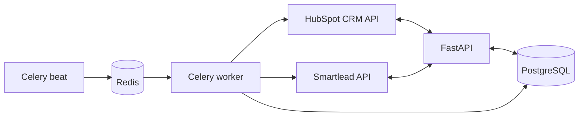

# La Neta — Backend de orquestación outbound (FastAPI + Celery)

API REST en **Python** que conecta **HubSpot** (CRM y origen de leads), **Smartlead** (secuencias de email) y una base **PostgreSQL** (p. ej. Supabase). Las operaciones largas y periódicas se ejecutan con **Celery** (worker + beat) sobre un broker **Redis**.

Este documento describe **lo que el backend hace hoy**, **propiedades y tiempos clave**, y el **enfoque** con el que se construyó.

---

## Papel de cada sistema

### HubSpot

- **Origen de verdad del contacto comercial**: búsqueda de contactos marcados como nuevos (`is_new_lead`), creación/actualización de filas locales y **marcado del contacto como procesado** para evitar re-ingesta.
- **Destino de sincronización**: el backend actualiza propiedades del contacto cuando hay token configurado (engagement, secuencia, IDs de Smartlead, métricas, calificación, fechas de apertura, textos derivados del último mensaje, etc.). Los nombres internos siguen el mapeo acordado con las propiedades del portal.

### Smartlead

- **Ejecución de la secuencia**: alta masiva de leads en campaña, export CSV de métricas por campaña, historial de mensajes por lead, y acciones puntuales (p. ej. pausa de lead según reglas de negocio en el servicio de estadísticas).

### Este programa (backend)

- **Orquestador y caché operativa**: no sustituye al CRM ni al ESP; **normaliza**, **persiste** y **decide** cuándo llamar a cada API, con **idempotencia** (email único, `hubspot_contact_id`, `smartlead_lead_id`) y **estado en base de datos** alineado a ambos mundos.
- **Punto de integración único** para operadores u otros sistemas: endpoints HTTP documentados en OpenAPI (`/docs`) y tareas programadas reproducibles vía Celery.

---

## Arquitectura lógica



- **`app/`**: FastAPI, esquemas Pydantic, dependencias de sesión DB y clientes opcionales.
- **`app/integrations/`**: clientes HTTP delgados (HubSpot, Smartlead) y constantes.
- **`app/services/`**: reglas de negocio (ingesta, push, estadísticas desde CSV, historial de mensajes, consultas para jobs programados).
- **`worker/`**: aplicación Celery, registro de tareas y **beat schedule** (intervalos leídos de configuración al cargar el módulo).
- **Migraciones**: Alembic bajo `backend/`; modelos SQLAlchemy en `app/models/` (`Lead`, `LeadStatistics`, `LeadMessageHistory`).

---

## Capacidades implementadas

### API REST (prefijos reales)

| Área | Método y ruta | Función |
|------|----------------|---------|
| Raíz | `GET /` | Estado y metadatos de servicio |
| Salud | `GET /health` | Comprueba conectividad a la base de datos |
| HubSpot | `POST /api/v1/hubspot/sync-new-leads` | Ingesta contactos con `is_new_lead=true` → upsert en `leads` → marca procesado en HubSpot |
| Smartlead | `POST /api/v1/smartlead/push-campaign-leads` | Envía leads locales sin `smartlead_lead_id` a la campaña (`ID_CAMPAIGN` o fallback en código), resuelve ID vía API por email, actualiza DB y HubSpot si aplica |
| Smartlead | `POST /api/v1/smartlead/sync-campaign-lead-statistics` | Descarga export CSV de la campaña, actualiza `lead_statistics` y campos en `Lead`, parchea HubSpot; reglas por categoría/replies (completar, pausar, etc.) |
| Smartlead | `POST /api/v1/smartlead/leads/{lead_id}/sync-message-history` | Descarga historial de mensajes, persiste en `lead_message_history`, actualiza lead y propiedades HubSpot relevantes |

La documentación interactiva está en **`/docs`** (Swagger UI).

### Celery — tareas y periodicidad

| Tarea (nombre registrado) | Qué hace | Programación (Beat) |
|---------------------------|----------|---------------------|
| `worker.tasks.hubspot_sync_and_smartlead_push` | 1) Misma lógica que `sync-new-leads`. 2) Push a Smartlead con **`ID_CAMPAIGN`** (campaña “actual” para altas nuevas). | Variable **`SCHEDULE_HUBSPOT_SYNC_SECONDS`** (por defecto **18 000 s ≈ 5 h**; rango permitido 1 h–24 h). Ajusta a ~4–6 h con p. ej. `14400` o `21600`. |
| `worker.tasks.smartlead_active_stats_and_message_history` | 1) Por cada **`campaign_id` distinto en BD** entre leads con `sequence_status` **active** (insensible a mayúsculas) y con `smartlead_lead_id`: sincroniza estadísticas desde el export. 2) Para esos leads, sincroniza **message-history** usando el **`campaign_id` guardado en cada fila** (no fuerza `ID_CAMPAIGN`). | Variable **`SCHEDULE_SMARTLEAD_ACTIVE_SECONDS`** (por defecto **3 600 s = 1 h**). |
| `hubspot.fetch_new_leads` | Solo ingesta HubSpot (compatibilidad); no está en el beat por defecto. | — |

**Importante:** si el equipo **cambia `ID_CAMPAIGN`**, los leads ya existentes siguen atados a su `campaign_id` en base de datos; el job horario **sigue actualizando** estadísticas e historial según esos valores, mientras que el job de HubSpot+push usa la **nueva** campaña solo para **nuevas altas**.

Comandos típicos (desde el directorio `backend/`, con entorno y Redis configurados):

```bash
celery -A worker.celery_app worker -l info
celery -A worker.celery_app beat -l info
```

---

## Propiedades y datos clave (resumen)

- **`leads`**: perfil comercial, `hubspot_contact_id`, `smartlead_lead_id`, `campaign_id`, `sequence_status`, `engagement_status`, contadores y fechas de apertura/clic/respuesta, scoring, tipo de respuesta, flags de calificación, etc.
- **`lead_statistics`**: snapshot alineado al export Smartlead (métricas y columnas útiles para reporting).
- **`lead_message_history`**: mensajes normalizados (incl. HTML cuando aplica) para auditoría y derivación de campos hacia HubSpot.

Los detalles de mapeo HubSpot ↔ columnas Smartlead ↔ columnas SQL viven en los **servicios** (`hubspot_ingest`, `smartlead_push`, `smartlead_lead_statistics`, `smartlead_message_history`) y en las migraciones.

---

## Variables de entorno relevantes

Definidas en **`backend/.env.example`** y cargadas vía **Pydantic Settings** (`app/core/config.py`):

| Variable | Rol |
|----------|-----|
| `DATABASE_URL` | PostgreSQL (también acepta `SUPABASE_DB_URL`) |
| `REDIS_URL` | Broker/backend de Celery |
| `HUBSPOT_ACCESS_TOKEN` | Token de Private App (aliases: `HUBSPOT_API_KEY`, `HUBSPOT_PRIVATE_APP_TOKEN`) |
| `SMARTLEAD_API_KEY` | API key Smartlead |
| `ID_CAMPAIGN` | ID de campaña Smartlead para **push de nuevos leads** y valor por defecto en endpoints que lo permiten (alias `SMARTLEAD_CAMPAIGN_ID`) |
| `SCHEDULE_HUBSPOT_SYNC_SECONDS` | Intervalo del beat: HubSpot + push |
| `SCHEDULE_SMARTLEAD_ACTIVE_SECONDS` | Intervalo del beat: estadísticas + historial (leads active) |
| `ENVIRONMENT` | `development` \| `staging` \| `production` |

---

## Qué se creó, cómo y enfoque

- **Cliente HubSpot** orientado a búsqueda/patch de contactos y **cliente Smartlead** para campañas, export CSV, leads por email e historial.
- **Servicios transaccionales** que agrupan lectura/escritura en DB, llamadas externas y parches a HubSpot, con resultados en **dataclasses** fáciles de testear.
- **Endpoints finos** por flujo (ingesta, push, estadísticas, historial) en lugar de un único “mega job” HTTP, lo que facilita pruebas manuales y depuración; el **beat** encadena lo necesario en segundo plano.
- **Celery beat** definido en `worker/celery_app.py`: los intervalos se resuelven al **importar** la app (si cambias env, reinicia beat/worker para tomar nuevos valores).
- **Pruebas automatizadas** (`backend/tests/`) con SQLite en memoria para lógica de dominio y rutas sin depender de APIs reales.

Documentación histórica de diseño y fases: **`INSTRUCTIONS.MD`** y **`use_case.md`** en la raíz del repo (pueden estar parcialmente alineados a nombres de endpoints antiguos; la fuente de verdad operativa es este README + OpenAPI + código).

---

## Resultado

Un **servicio API** que automatiza el ciclo: **lead nuevo en HubSpot** → **registro local** → **alta en Smartlead** → **sincronización periódica de métricas e historial** → **reflejo en HubSpot**, con **PostgreSQL** como estado interno y **Celery** para cargas y calendarios predecibles.

---

## Documentación

- **API propia (OpenAPI):** con el servidor en marcha, abre `/docs` o `/redoc` para el contrato HTTP de este backend.
- **Postmaster — status y salud de dominios:** ver [Postmaster - Domains Health & Status](backend/README_POSTMASTER_DOMAIN_HEALTH.md) para alcance, variables, endpoints, schemas, ejecución del job y resultados persistidos.
- **HubSpot CRM — búsqueda de contactos (referencia usada en ingesta):** [HubSpot API Docs — Search contacts](https://developers.hubspot.com/docs/api-reference/latest/crm/objects/contacts/search/search-contacts?playground=open)
- **Smartlead:** [SmartLead API Docs](https://api.smartlead.ai/introduction)
